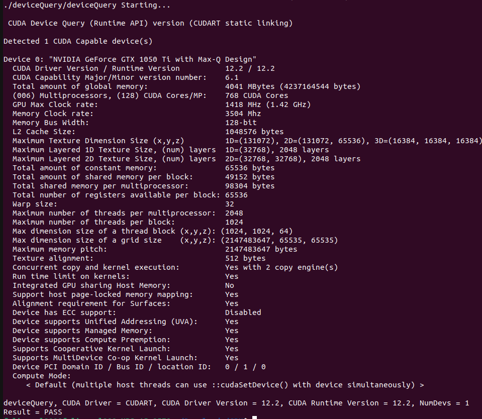
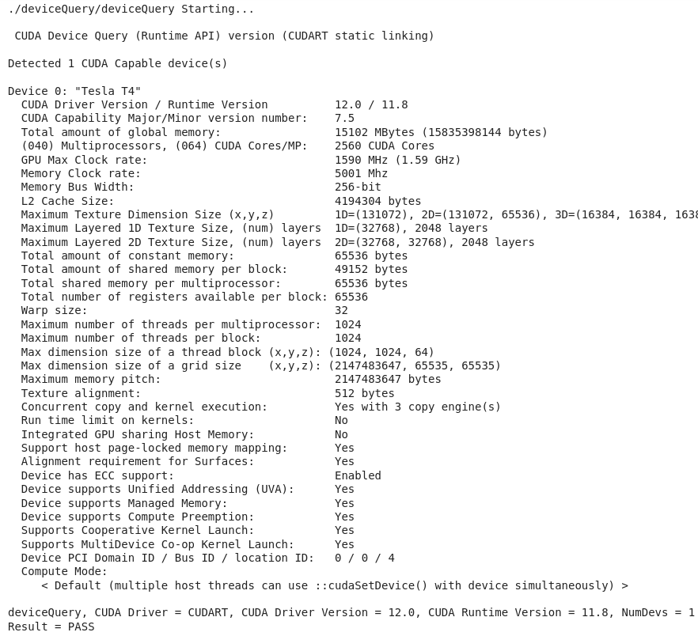
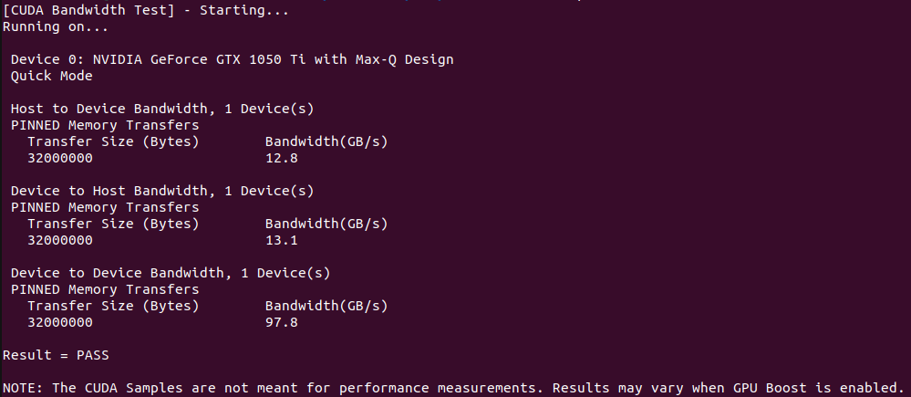
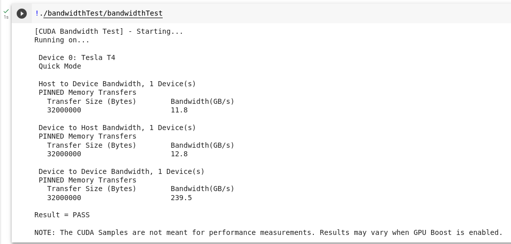
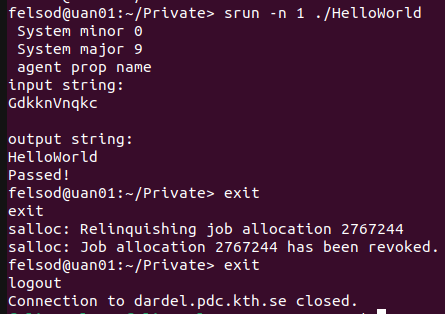

# Assignment 1

Felix Söderman DD2360 HT23\
Github: https://github.com/felixcool200/DD2360HT23

**Individual contributions:** Both students worked on 90% of the project together (including writing the report), while communicating verbally. The last 10% included scheduling conflicts where the students worked individually on the code. Both provided ideas for potential optimizations, and each wrote about 50% of the code and report.

## Exercise 1 - Reflection on GPU-accelerated Computing
1. List the main differences between GPUs and CPUs in terms of architecture.

    **ANSWER:** The main differance between the two is that CPUs are based on Latency oriented processor architecture. This means that it is designed to minimize the time it takes to complete a single task. This results in a few cores that have high clock speed (and high energy usage). A CPU is thus good at solving single threaded tasks fast, such as sorting elements in a list.
  
    GPUs on the other hand use a throughput-oriented processor architecture. This means it is designed to maximize the amount of problems it can solve rather than making sure they are completed as soon as they are created. GPUs thus have many cores and is good at completling task that are parallelizable, such as AI workloads or processing individual pixels on a screen.

1. Check the latest Top500 list that ranks the top 500 most powerful supercomputers in the world. In the top 10, how many supercomputers use GPUs Report the name of the supercomputers and their GPU vendor (Nvidia, AMD, ...) and model.

    **ANSWER:**
    Since the definition of GPU is quite vauge. I will also include computers that run other type of accelerator cards that have similar capabilites.

    1	Frontier - HPE Cray EX235a, **AMD** Instinct MI250X

    <!-- 2 Supercomputer Fugaku - Supercomputer Fugaku, A64FX 48C 2.2GHz -->

    3	LUMI - HPE Cray EX235a, **AMD** Instinct MI250X

    4	Leonardo - BullSequana XH2000, **NVIDIA** A100 SXM4 64 GB
    
    5	Summit - IBM Power System AC922, **NVIDIA** Volta GV100

    6	Sierra - IBM Power System AC922, **NVIDIA** Volta GV100

    <!-- 7	Sunway TaihuLight - Sunway MPP, **Sunway** SW26010 260C 1.45GHz -->

    8	Perlmutter - HPE Cray EX235n, **NVIDIA** A100 SXM4 40 GB

    9	Selene - NVIDIA DGX A100, **NVIDIA** A100

    10 Tianhe-2A - TH-IVB-FEP Cluster, Intel Xeon E5-2692v2 12C 2.2GHz, **National University of Defense Technology (NUDT)** Matrix-2000
    NOTE that this last one is not a GPU per say but an accelerator card.

1. One main advantage of GPU is its power efficiency, which can be quantified by Performance/Power, e.g., throughput as in FLOPS per watt power consumption. Calculate the power efficiency for the top 10 supercomputers. (Hint: use the table in the first lecture)

    **ANSWER:**
    One can clearly see that the machines running GPUs are much more power efficient than those who does not.

    1	Frontier - RMax = 1194 [PFLOPS], Power = 22703 [kW] => Power efficiency = 52.59 [GFLOPS/watts]

    2 Supercomputer Fugaku - RMax = 442.01 [PFLOPS], Power = 29,899.23 kW [kW]  => Power efficiency = 14.78 [GFLOPS/watts]

    3	LUMI - RMax = 309.10 [PFLOPS], Power = 6015.77 [kW] => Power efficiency = 51.38 [GFLOPS/watts]

    4	Leonardo - RMax = 238.70 [PFLOPS], Power = 7404.40 [kW] => Power efficiency = 32.24 [GFLOPS/watts]
    
    5	Summit - RMax = 148.60 [PFLOPS], Power = 10096.00 [kW] => Power efficiency = 14.72 [GFLOPS/watts]

    6	Sierra - RMax = 94.64 [PFLOPS], Power = 7438.28 [kW] => Power efficiency = 12.72 [GFLOPS/watts]

    7	Sunway TaihuLight - RMax = 93.01 [PFLOPS], Power = 15371 [kW] => Power efficiency = 6.05 [GFLOPS/watts]

    8	Perlmutter - RMax = 70.87 [PFLOPS], Power = 2589 [kW] => Power efficiency = 27.37 [GFLOPS/watts]

    9	Selene - RMax = 63.46 [PFLOPS], Power = 2646 [kW] => Power efficiency = 23.98 [GFLOPS/watts]

    10 Tianhe-2A - RMax = 61.44 [PFLOPS], Power = 18482 [kW] => Power efficiency = 3.32 [GFLOPS/watts]


## Exercise 2 - Query Nvidia GPU Compute Capability
1. The screenshot of the output from running deviceQuery test in /1_Utilities.

    **ANSWER:** 
    The screenshot of the output from you running deviceQuery test.

    Screenshot from running Device Query on Felix laptop
    
    Screenshot from running Device Query on Google Colab
    

2. What is the Compute Capability of your GPU device?
    **ANSWER:** 
    Felix Laptop with GTX 1050 ti Max-Q has a compute compatibility of 6.1.
    The NVIDIA T4 on Google Colab has a compute compatibility of 7.5

3. The screenshot of the output from running bandwidthTest test in /1_Utilities.

    **ANSWER:**
    Screenshot from running bandwidthTest on Felix laptop
    
    Screenshot from running bandwidthTest on Google Colab
    

4. How will you calculate the GPU memory bandwidth (in GB/s) using the output from deviceQuery? (Hint: memory bandwidth is typically determined by clock rate and bus width, and check what double date rate (DDR) may impact the bandwidth). Are they consistent with your results from bandwidthTest?

    **ANSWER:**
    To calculate the memory bus speed GB/s.
    First translate the memory buss width from bits to Bytes by dividing it by 8.Then take the Memory Clock rate and double it to to get the double data rate(DDR). After that take the new bus width [B] divided by the new memory clock lock speed [Hz] which then equals [B\*Hz] = [B\*(1/s)] = [B/s]. Lastly divide it 10^9 to make it [GB/s].

    Thus using the laptop case:

        Bus Width:
        128 bit/8 = 16 Bytes.

        Clock Rate:
        3504 MHz*2 = 7008 MHz.

        Memory bus speed = (16 * (7008 * 10^6)) / 10^9 = 112.128 GB/s.


## Exercise 3 - Rodinia CUDA benchmarks and Comparison with CPU

1. Compile both OMP and CUDA versions of your selected benchmarks. Do you need to make any changes in Makefile?

    **ANSWER:**
    When running the CUDA version of particalfilter the compute capability had to be changed to match Felix laptop GPU by changing ```sm_13``` to ```sm_61``` on line 12 and line 15 in the makefile.

    When running hotspot3D the first line in the makefile as incorrect and neededto be changed from

    ``` include ~/rodinia_3.0/common/make.config``` \
    to\
    ``` include ../../common/make.config ```
2. Ensure the same input problem is used for OMP and CUDA versions. Report and compare their execution time. 

    **ANSWER:**
    ### Running particalfilter
    #### OpenMP

        make clean
        make openmp
        
        cat run
        ./particle_filter -x 128 -y 128 -z 10 -np 100000

    ##### RESULTS:

        ./run
        ENTIRE PROGRAM TOOK 5.897769

    #### CUDA

        make clean
        make all

        cat run
        ./particlefilter_naive -x 128 -y 128 -z 10 -np 100000

    ##### RESULTS:

        ./run
        ENTIRE PROGRAM TOOK 1.680555

    ### Running hotspot3D
    #### OpenMP:
          make clean
          make 3D

          cat run
          ./3D 512 8 10000 ../../data/hotspot3D/power_512x8 ../../data/hotspot3D/temp_512x8 output.out

          ./run

    ##### RESULTS:

        12 threads running
        Time: 38.112 (s)
        Accuracy: 4.856862e-05

    #### CUDA

          make clean
          make release
          
          cat run
          ./3D 512 8 10000 ../../data/hotspot3D/power_512x8 ../../data/hotspot3D/temp_512x8 output.out
          
          ./run

    ##### RESULTS:

          Time: 9.737 (s)
          Accuracy: 4.096975e-05

    
3. Do you observe expected speedup on GPU compared to CPU? Why or Why not?

    **ANSWER:**
    Over all the three workloads the CUDA version ran faster. This is most likley since all the workload were easily parallelizable. When running the programs with fewer iterations/smaller values (for example amount of particles in the particlefilter) the CPU and GPU had comparable speeds but when incresing the amount of particles in parallel the CUDA program ran much faster.

## Exercise 4 - Run a HelloWorld on AMD GPU

1. How do you launch the code on GPU on Dardel supercomputer?
    **ANSWER:**
    ```
    ssh -o GSSAPIAuthentication=yes felsod@dardel.pdc.kth.se
    cd Private
    <ADD FILES NEEDED HERE>
    make
    salloc -A edu23.dd2360 -p gpu -N 1 -t 00:10:00
    srun -n 1 ./HelloWorld
    ```

2. Include a screenshot of your output from Dardel
    **ANSWER:**
    Screenshot from running Dardel
    