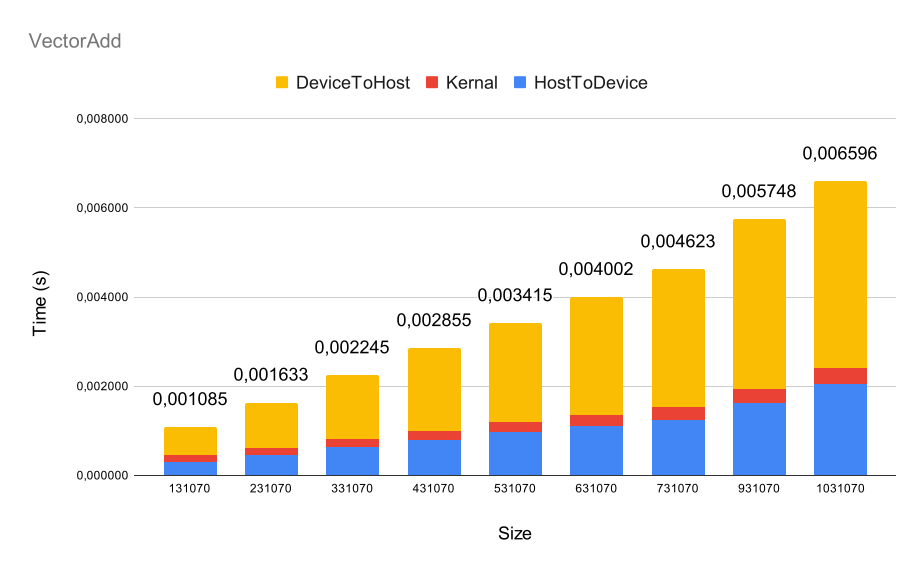

# Assignment 3

Felix Söderman DD2360 HT23\
Github: https://github.com/felixcool200/DD2360HT23

## Exercise 1 - Your first CUDA program and GPU performance metrics

1. Explain how the program is compiled and run.

    **ANSWER:**
    To compile the program use the created a make file that executes the following command:

    ```nvcc -arch=sm_61 vector.cu -o a.out```

2. For a vector length of N:

    1. How many floating operations are being performed in your vector add kernel? 
        
        **ANSWER:**
        When adding a two vectors of length N there are N addition floating point operations that are performed.

    2. How many global memory reads are being performed by your kernel? 
        
        **ANSWER:**
        Since both vectors are read once for each addition there is a total of 2N reads from global memory.

3. For a vector length of 1024:
    1. Explain how many CUDA threads and thread blocks you used. 

        **ANSWER:**
        I used (1024+32-1)/32 = 32 thread blocks and I used 32*32=1024 CUDA threads.
        
    2. Profile your program with Nvidia Nsight. What Achieved Occupancy did you get?

        **ANSWER:**
        I got Achieved Occupancy of 3.12% and a Theoretical Occupancy of 50%.

        When incresing the threads per block from 32 to 64 the Theoretical Occupancy increesed to 100% and the Achieved Occupancy to 6.19%

4. Now increase the vector length to 131070:

    1. Did your program still work? If not, what changes did you make?

        **ANSWER:**
        The program still works. No changes needed to be made.

    2. Explain how many CUDA threads and thread blocks you used.

        **ANSWER:**
        I used (131070+32-1)/32 = 4096 thread blocks and I used 4096*32 = 131072 CUDA threads.

    3. Profile your program with Nvidia Nsight. What Achieved Occupancy do you get now?

        **ANSWER:**
        Achieved Occupancy is now 32.57% (at TPB at 32) and 74.35% (at TPB at 64)


5. Further increase the vector length (try 6-10 different vector length), plot a stacked bar chart showing the breakdown of time including (1) data copy from host to device (2) the CUDA kernel (3) data copy from device to host. For this, you will need to add simple CPU timers to your code regions.

    **ANSWER:**
    


## Exercise 2 - Your first CUDA program and GPU performance metrics

1. Name three applications domains of matrix multiplication.

    **ANSWER:**
    One application is machine learning, where matrix multiplication forms the foundation for training models. This is why tensor cores are specifically developed for performing matrix multiplications.

    Another application is solving linear equation systems, which is essential in engineering, as many systems can be modeled as a linear combination of variables.

    Lastly, in game programming, matrix multiplication can be used to rotate objects in 3D space, often employing rotation matrices.

2.  How many floating operations are being performed in your matrix multiply kernel? 

    **ANSWER:**

    I have implemented three different versions of my kernel. The first one utilizes atomicAdd and performs two floating-point operations per thread: one for multiplying the values and another for atomicAdd to the C vector.

    The second version initially involves two floating-point operations, similar to the first one, but instead of atomicAdd, it adds to a shared variable. Additionally, if threadIdx.x equals 0, it performs an additional numAColumns floating-point operations when calculating the sum over the shared variable.

    Finally, my last kernel always runs numAColumns floating-point operations per thread.

    When considering an entire run, I multiply the number from the previous question by the number of threads created, which is equal to the product of numCRows and numCColumns for the first and third kernel implementations. However, for the second one, it results in numCRows * numCColumns * numAColumns, as it conducts all calculations in parallel.

    (I added a table at the end of question 3 to show all values)


3. How many global memory reads are being performed by your kernel?

    **ANSWER:**
    All three versions of my kernals only read the global memory twice.

    | Kernal                                                                                                     	| gemmShared                                                  	| gemmAtomicAdd                            	| gemmBIG                                  	|
    |------------------------------------------------------------------------------------------------------------	|-------------------------------------------------------------	|------------------------------------------	|------------------------------------------	|
    | Number of threads (excluding CUDA threads that do no global memory reads and no floating point operations) 	| numCColumns * numCRows * numAColumns                        	| numCColumns * numCRows * numAColumns     	| numCColumns * numCRows                   	|
    | Number of floating point operations (per thread)                                                           	| 2 or 2+numAColumns                                          	| 2                                        	| 2*numAColumns                            	|
    | Global memory reads (per thread)                                                                           	| 2                                                           	| 2                                        	| 2*numAColumns                            	|
    | Number of floating point operations (total)                                                                	| (2 or 2+numAColumns) * numCColumns * numCRows * numAColumns 	| 2 * numCColumns * numCRows * numAColumns 	| 2 * numAColumns * numCColumns * numCRows 	|
    | Global memory reads (total)                                                                                	| 2 * numCColumns * numCRows * numAColumns                    	| 2 * numCColumns * numCRows * numAColumns 	| 2 * numAColumns * numCColumns * numCRows     	|

4. For a matrix A of (128x128) and B of (128x128):
        
    1. Explain how many CUDA threads and thread blocks you used.

        **ANSWER:**
        The first and second kernal implementation have numCRows * numCColumns * numAColumns = 128^3 = 2097152 CUDA threads.
        These two methods use a threads per block of numARows = 128.
        Which results in 2097152/128 = 16384 thread blocks.

        For the third kernal implementation there are numCRows * numCColumns kernals which means that in this case it is 128^2 = 16384 CUDA threads.
        This method uses thread blocks 16384
        (128+32-1)/32 -> 4 threads in each dimension which results in a 4\*4 = 16 thread per block.
        Which results in 16384/16 = 1024 thread blocks.

    2. Profile your program with Nvidia Nsight. What Achieved Occupancy did you get? 

        **ANSWER:**
        | Kernal                 	| gemmShared 	| gemmAtomicAdd 	| gemmBIG 	|
        |------------------------	|------------	|---------------	|---------	|
        | Cuda threads           	| 2097152      	| 2097152       	| 16384   	|
        | Cuda thread blocks     	| 16384       	| 16384           	| 1024    	|
        | Achieved occupancy (%) 	| 88.35      	| 88.55         	| 98.15   	|

5. For a matrix A of (511x1023) and B of (1023x4094):
    
    1. Did your program still work? If not, what changes did you make?

        **ANSWER:**
        This worked for all three of my kernal versions (first and second kernal does not allow for 1023 to go above 1024, since that would need more than 1024 threads per block which is not possible).

    2. Explain how many CUDA threads and thread blocks you used.

        **ANSWER:**
        The first and second kernal implementation have numCRows * numCColumns * numAColumns which results in 511 * 4094 * 1023  = 2140150782 CUDA threads.
        These two methods use a threads per block of numARows = 128.
        Which results in 2140150782/1023 = 2092034 thread blocks.

        For the third kernal implementation there are numCRows * numCColumns kernals which means that in this case it is 511 * 4094 = 2092034 CUDA threads.
        These two methods use a threads per block of numARows = 511.
        Which results in 2092034/511 = 4094 thread blocks.

    3. Profile your program with Nvidia Nsight. What Achieved Occupancy do you get now?

        **ANSWER:**
        | Kernal                 	| gemmShared 	| gemmAtomicAdd 	| gemmBIG 	|
        |------------------------	|------------	|---------------	|---------	|
        | Cuda threads           	| 2140150782 	| 2140150782    	| 2092034 	|
        | Cuda thread blocks     	| 2092034      	| 2092034          	| 4094   	|
        | Achieved occupancy (%) 	| 16.33      	| 74.01         	| 98.64   	|

6. Further increase the size of matrix A and B, plot a stacked bar chart showing the breakdown of time including (1) data copy from host to device (2) the CUDA kernel (3) data copy from device to host. For this, you will need to add simple CPU timers to your code regions. Explain what you observe.

    **ANSWER:**
    In the plot one can see that the kernal time is by far the biggest contributing factor to the total time spent running the program. One can also see that the kernal called gemmBIG is the fastest. I assume this is becuase it has a order of magnitude less kernals (but each kernal does more work). This indicates that the overhead of creating kernals is substantial compared to the work done in gemmShared and gemmAtomicAdd.

    
    
    


7. Now, change DataType from double to float, re-plot the a stacked bar chart showing the time breakdown. Explain what you observe. 

    **ANSWER:**
    Firstly I had to decrese the max random number from 10000 to 100 and increse the tolerane from 0.004 to 1. This is because otherwise the float was not able to store the result to high enough precision.

    
    
    