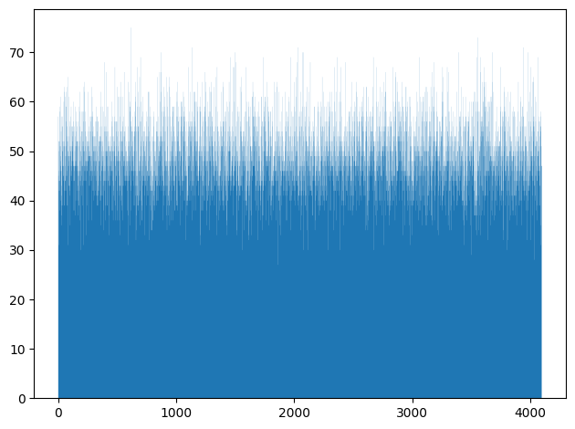
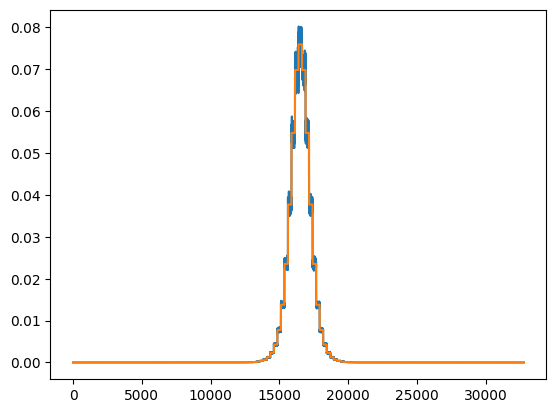
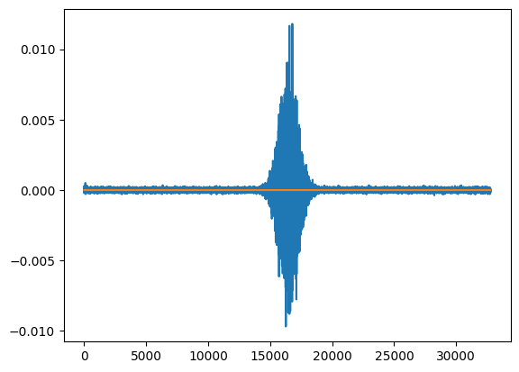

# Assignment 3

Felix Söderman DD2360 HT23\
Github: https://github.com/felixcool200/DD2360HT23

## Exercise 1 - Histogram and Atomics

1. Describe all optimizations you tried regardless of whether you committed to them or abandoned them and whether they improved or hurt performance.

    **ANSWER:**
    My first implementation looked like this:

    Here I already done som optimizations. Such as removing num_bins as a parameter since it is a compile time constant.

    ``` cpp 
    __global__ void histogram_kernel(unsigned int *input, unsigned int *bins, unsigned int num_elements){

        __shared__ unsigned int temp_bins[NUM_BINS];
        int index = blockIdx.x * blockDim.x + threadIdx.x;
            if(threadIdx.x == 0){
                for(int i = 0; i < NUM_BINS;++i){
                    temp_bins[i] = 0;
                }
            }
            __syncthreads();

            if (index < num_elements){
                atomicAdd(&temp_bins[input[index]],1);
            }

            __syncthreads();
            if(threadIdx.x == 0){
                for(int i = 0; i < NUM_BINS; ++i){
                    atomicAdd(&(bins[i]),temp_bins[i]);
                }
            }

    }
    ```
    this had a kernal run time of: 0.001512 s (with input set to 1 000 000)

    I then tried to paralize the creation of the shared variable

    ```cpp
    __global__ void histogram_kernel(unsigned int *input, unsigned int *bins, unsigned int num_elements){

        __shared__ unsigned int temp_bins[NUM_BINS];
        int index = blockIdx.x * blockDim.x + threadIdx.x;
        for(int i = 0; i < NUM_BINS/TPB;++i){
            temp_bins[i*TPB+threadIdx.x] = 0;
        }
        __syncthreads();

        if (index < num_elements){

            atomicAdd(&temp_bins[input[index]],1);
        }

        __syncthreads();

        if(threadIdx.x == 0){
            for(int i = 0; i < NUM_BINS; ++i){
                unsigned int tmp = temp_bins[i];
                if(tmp != 0){
                    atomicAdd(&(bins[i]),tmp);
                }
            }
        }
    }
    ```


    this had a kernal run time of: 0.005442 s (with input set to 1 000 000).

    Then I tried to instead parallelize the adding the temporary shared variable to the global variable.


    ``` cpp 
    __global__ void histogram_kernel(unsigned int *input, unsigned int *bins, unsigned int num_elements){

        __shared__ unsigned int temp_bins[NUM_BINS];
        int index = blockIdx.x * blockDim.x + threadIdx.x;
        if(threadIdx.x == 0){
            for(int i = 0; i < NUM_BINS;++i){
                temp_bins[i] = 0;
            }
        }
        __syncthreads();

        if (index < num_elements){
            atomicAdd(&temp_bins[input[index]],1);
        }
         __syncthreads();

        for(int i = 0; i < NUM_BINS/TPB;++i){
            if(temp_bins[TPB * i + threadIdx.x] != 0){
                atomicAdd(&(bins[TPB * i + threadIdx.x]),temp_bins[TPB * i + threadIdx.x]);
            }
        }
    }
    ```
    this had a kernal run time of: 0.000394 s (with input set to 1 000 000).
    
    I then tried to combine the last two attempts and it resulted in the fastest kernal I was able to create.
    ```cpp
    __global__ void histogram_kernel(unsigned int *input, unsigned int *bins, unsigned int num_elements){

        __shared__ unsigned int temp_bins[NUM_BINS];
        int index = blockIdx.x * blockDim.x + threadIdx.x;
        
        for(int i = 0; i < NUM_BINS/TPB;++i){
            temp_bins[i*TPB+threadIdx.x] = 0;
        }
        __syncthreads();

        if (index < num_elements){
            atomicAdd(&temp_bins[input[index]],1);
        }
        __syncthreads();

        for(int i = 0; i < NUM_BINS/TPB;++i){
            if(temp_bins[TPB * i + threadIdx.x] != 0){
                atomicAdd(&(bins[TPB * i + threadIdx.x]),temp_bins[TPB * i + threadIdx.x]);
            }
        }
    }
    ```
    this had a kernal run time of: 0.000170 s (with input set to 1 000 000). (This time is similar to how fast it takes to launch the cpu timer thus it is very hard to see any further improvments).

    
    Lastly I tried to remove the if statment around the atomic add (to simply add the zeros aswell)

    ```cpp
    __global__ void histogram_kernel(unsigned int *input, unsigned int *bins, unsigned int num_elements){

        __shared__ unsigned int temp_bins[NUM_BINS];
        int index = blockIdx.x * blockDim.x + threadIdx.x;
        
        for(int i = 0; i < NUM_BINS/TPB;++i){
            temp_bins[i*TPB+threadIdx.x] = 0;
        }
        __syncthreads();

        if (index < num_elements){
            atomicAdd(&temp_bins[input[index]],1);
        }
        __syncthreads();

        for(int i = 0; i < NUM_BINS/TPB;++i){
            atomicAdd(&(bins[TPB * i + threadIdx.x]),temp_bins[TPB * i + threadIdx.x]);
        }
    }
    ```
    This had a simiar time to the last solution so I decided to keep the if statment.

2. Which optimizations you chose in the end and why? 
    This is my final kernal. I applied both parralization to the setting the shared memory to zero and adding the shared variable to the global memory.

    **ANSWER:**
    ```cpp
    __global__ void histogram_kernel(unsigned int *input, unsigned int *bins, unsigned int num_elements){

        __shared__ unsigned int temp_bins[NUM_BINS];
        int index = blockIdx.x * blockDim.x + threadIdx.x;
        
        for(int i = 0; i < NUM_BINS/TPB;++i){
            temp_bins[i*TPB+threadIdx.x] = 0;
        }
        __syncthreads();

        if (index < num_elements){
            atomicAdd(&temp_bins[input[index]],1);
        }
        __syncthreads();

        for(int i = 0; i < NUM_BINS/TPB;++i){
            if(temp_bins[TPB * i + threadIdx.x] != 0){
                atomicAdd(&(bins[TPB * i + threadIdx.x]),temp_bins[TPB * i + threadIdx.x]);
            }
        }
    }
    ```
3. How many global memory reads are being performed by your kernel? Explain 
    
    **ANSWER:**
    Only a single global memory read is done (per thread), this is when temp_bin is indexed by input. All other reads are from the shared memory. (I create inputLength threads thus inputLength is the amount of total global memory reads.)

4. How many atomic operations are being performed by your kernel? Explain

    **ANSWER:**
    There are two atomicAdd operations per thread thus 2* inputLength in total.

5. How much shared memory is used in your code? Explain

    **ANSWER:**
    I create an unsiged int array of size 4096, Thus 4096\*4 bytes per unsiged int = 32768 bytes are used per block. Since there is 1024 threads per block there There is going to be a total of (inputLength/1024)*32768 in total.

6. How would the value distribution of the input array affect the contention among threads? For instance, what contentions would you expect if every element in the array has the same value? 

    **ANSWER:**
    If every element would need to be placed in a single bucket. All threads needs to write (atomicAdd) to the same shared memory location and thus have to wait for each other to not create corrupted memory or a datarace. This would remove most of the gains of parallizing the code in the first place since all threads in a block would have to wait for each other. It would still be in parallel across the inputLength/1024 different blocks.

7. Plot a histogram generated by your code and specify your input length, thread block and grid.

    **ANSWER:**
    Histogram with input length of 200 000 with a 1024 threads per block and 4 total blocks.
    


8. For a input array of 1024 elements, profile with Nvidia Nsight and report Shared Memory Configuration Size and Achieved Occupancy. Did Nvsight report any potential performance issues?

    **ANSWER:**
    For histogram_kernel:

        Achieved Occupancy: 48.52%
        Shared Memory Configuration Size: 32.77 Kbyte.
    
    Nsight gave the following warnings

    "This kernel grid is too small to fill the available resources on this device, resulting in only 0.0 full waves across all SMs. Look at Launch Statistics for more details."

    and          

    "The grid for this launch is configured to execute only 2 blocks, which is less than the GPU's 40 multiprocessors. This can underutilize some multiprocessors. If you do not intend to execute this kernel concurrently with other workloads, consider reducing the block size to have at least one block per multiprocessor or increase the size of the grid to fully utilize the available hardware resources. See the Hardware Model (https://docs.nvidia.com/nsight-compute/ProfilingGuide/index.html#metrics-hw-model) description for more details on launch configurations."

    and 

    "This kernel's theoretical occupancy is not impacted by any block limit. The difference between calculated theoretical (100.0%) and measured achieved occupancy (48.5%) can be the result of warp scheduling overheads or workload imbalances during the kernel execution. Load imbalances can occur between warps within a block as well as across blocks of the same kernel. See the CUDA Best Practices Guide (https://docs.nvidia.com/cuda/cuda-c-best-practices-guide/index.html#occupancy) for more details on optimizing occupancy."

    for convert_kernel:

        Achieved Occupancy: 48.01%
        Shared Memory Configuration Size: 32.77 Kbyte.

    "This kernel grid is too small to fill the available resources on this device, resulting in only 0.1 full waves across all SMs. Look at Launch Statistics for more details. "

    and

    "The grid for this launch is configured to execute only 8 blocks, which is less than the GPU's 40 multiprocessors. This can underutilize some multiprocessors. If you do not intend to execute this kernel concurrently with other workloads, consider reducing the block size to have at least one block per multiprocessor or increase the size of the grid to fully utilize the available hardware resources. See the Hardware Model (https://docs.nvidia.com/nsight-compute/ProfilingGuide/index.html#metrics-hw-model) description for more details on launch configurations"

    and

    "This kernel's theoretical occupancy is not impacted by any block limit. The difference between calculated theoretical (100.0%) and measured achieved occupancy (48.0%) can be the result of warp scheduling overheads or workload imbalances during the kernel execution. Load imbalances can occur between warps within a block as well as across blocks of the same kernel. See the CUDA Best Practices Guide (https://docs.nvidia.com/cuda/cuda-c-best-practices-guide/index.html#occupancy) for more details on optimizing occupancy."


## Exercise 2 - A Particle Simulation Application
1. Describe the environment you used, what changes you made to the Makefile, and how you ran the simulation.

    **ANSWER:**
    I ran the code on google colab. The only change was to change the cuda compatability from 3.0 to 6.1. (ARCH=sm_30 to ARCH=sm_61 in Makefile).

    To run the simulation i ran the following commands on colab.
    
        !git clone https://github.com/KTH-HPC/sputniPIC-DD2360.git
        !cp /content/sputniPIC-DD2360/src/Particles.cu /content/ParticlesCPU.cu 

        !rm -rf /content/sputniPIC-DD2360/bin/data/
        !rm -rf /content/sputniPIC-DD2360/bin/data_GPU/
        !rm /content/sputniPIC-DD2360/src/Particles.cu

        # ==================== GPU ====================
        !cp /content/ParticlesGPU.cu /content/sputniPIC-DD2360/src/Particles.cu

        %cd /content/sputniPIC-DD2360/
        !make
        %cd /content/sputniPIC-DD2360/bin
        !mkdir -p data
        !./sputniPIC.out /content/sputniPIC-DD2360/inputfiles/GEM_2D.inp
        %cd /content

        !mv /content/sputniPIC-DD2360/bin/data/ /content/sputniPIC-DD2360/bin/data_GPU/

        # ==================== CPU ====================
        !rm /content/sputniPIC-DD2360/src/Particles.cu
        !cp /content/ParticlesCPU.cu /content/sputniPIC-DD2360/src/Particles.cu

        %cd /content/sputniPIC-DD2360/
        !make
        %cd /content/sputniPIC-DD2360/bin
        !mkdir -p data
        !./sputniPIC.out /content/sputniPIC-DD2360/inputfiles/GEM_2D.inp
        %cd /content
2. Describe your design of the GPU implementation of mover_PC() briefly. 

    **ANSWER:**
    I decided to parallelize the for loop responsable for each particle. The inner loops seem hard to parallelize since they depend on each other and are inherintly iterative.

    My implementation thus copies part, field, grd, param to the device, does all calulations and copies part back to be able to use the results.

3. Compare the output of both CPU and GPU implementation to guarantee that your GPU implementations produce correct answers.

    **ANSWER:**
    To compare the outputs I used the wrote a python script that compares the output files against each other (Since the results are float there is a epsilon that allows for small differences in the output). 


    ```python
    !diff /content/sputniPIC-DD2360/bin/data/B_10.vtk /content/sputniPIC-DD2360/bin/data_GPU/B_10.vtk
    !diff /content/sputniPIC-DD2360/bin/data/E_10.vtk /content/sputniPIC-DD2360/bin/data_GPU/E_10.vtk
    !diff /content/sputniPIC-DD2360/bin/data/sputniPICparameters.txt /content/sputniPIC-DD2360/bin/data_GPU/sputniPICparameters.txt


    files = ["rhoe_10.vtk","rho_net_10.vtk","rhoi_10.vtk"]
    EPSILON = 0.02

    def compare():
    for file in files:
        print("FILE:",file)
        GPU = open("/content/sputniPIC-DD2360/bin/data_GPU/" + file, "r").read().split()
        CPU = open("/content/sputniPIC-DD2360/bin/data/" + file, "r").read().split()
        if len(CPU) != len(GPU):
        print("Error diff length, not the same")
        return
        else:
        for i in range(len(GPU)):
            try:
            fGPU = float(GPU[i])
            fCPU = float(CPU[i])
            diff = abs(fGPU - fCPU)

            if(abs(fGPU - fCPU) >= EPSILON):
                print("Error to big diff")
                return
            except ValueError:
            if(GPU[i] != CPU[i]):
                print("Error not equal",GPU[i],CPU[i])
                return
    compare()
    ```

    The output differs which is most likley because the GPU seem to have more limited precision when it comes to floating point numbers.

    To make sure that they are close enough I also plotted the values:


    
    
    

    Here is the code to make the graphs.

    ```python
    import matplotlib
    import matplotlib.pyplot as plt

    files = ["rhoe_10.vtk","rho_net_10.vtk","rhoi_10.vtk"]

    figIndex = 0

    def plotsNStuff():
    global figIndex
    for file in files:
        data1 = []
        data2 = []
        print("FILE:",file)
        with open('/content/sputniPIC-DD2360/bin/data/'+file) as f:
            lines = f.readlines()
            for line in lines:
            try:
                data1.append(float(line))
            except:
                pass

        with open('/content/sputniPIC-DD2360/bin/data_GPU/'+file) as f:
            lines = f.readlines()
            for line in lines:
            try:
                data2.append(float(line))
            except:
                pass
        plt.figure(figIndex)
        figIndex += 1
        plt.plot(range(len(data1)), data1)

        #plt.figure(figIndex)
        figIndex += 1
        plt.plot(range(len(data2)), data2)

    plotsNStuff()
    plt.show()
    ```

4. Compare the execution time of your GPU implementation with its CPU version.

    **ANSWER:**
    CPU:
    **************************************
   Tot. Simulation Time (s) = 60.4837

   Mover Time / Cycle   (s) = 3.24923

   Interp. Time / Cycle (s) = 2.50258
    **************************************

    GPU:
    **************************************
   Tot. Simulation Time (s) = 28.7672

   Mover Time / Cycle   (s) = 0.0432936

   Interp. Time / Cycle (s) = 2.46405
    **************************************

    Here we see that the majority of the mover times has been removed. With the ten cycles we use here we can see that the total mover time went from 32.4s to 0.4s.
    
    The next step in improving the code would be to parallelize the interpolation, since it is now the main part of the total simulation time and takes 24s out of the total 28s.