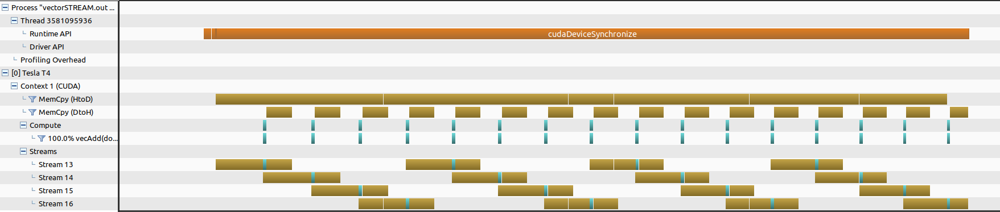
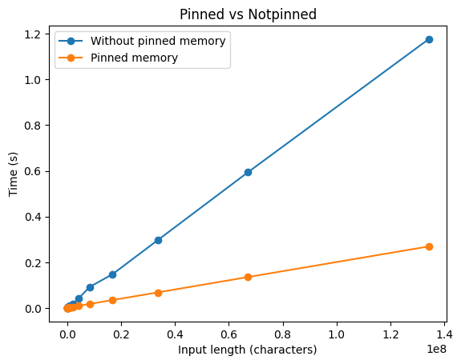
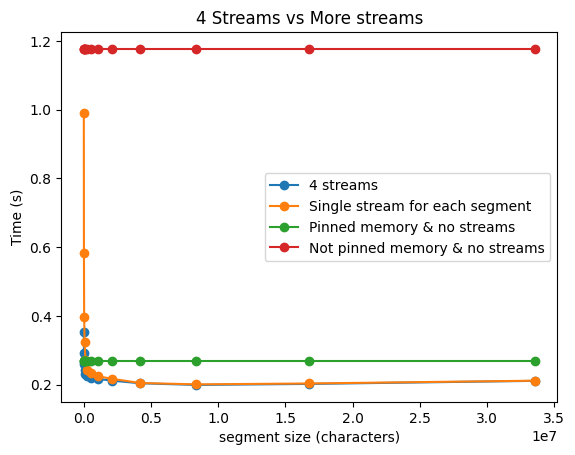
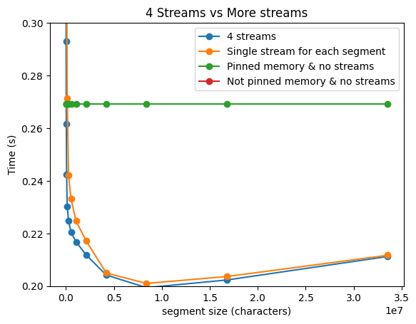
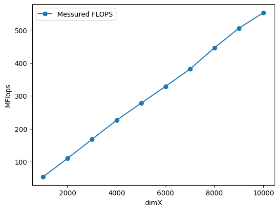
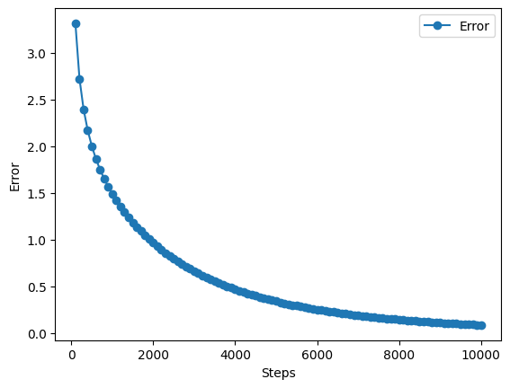
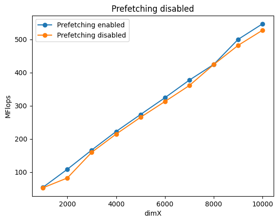

# Assignment 4

Felix Söderman DD2360 HT23\
Github: https://github.com/felixcool200/DD2360HT23

## Exercise 1 -  Thread Scheduling and Execution Efficiency 

1. Assume X=800 and Y=600. Assume that we decided to use a grid of 16X16 blocks. That is, each block is organized as a 2D 16X16 array of threads. How many warps will be generated during the execution of the kernel? How many warps will have control divergence? Please explain your answers.

    **ANSWER:**
    There are 800/16 = 50 blocks in X direction and 600/16 = 37.5 blocks in Y direction. Each warp is 32 threads this means that each block will have 8 warps. When flattening each block one can see that each warp takes two rows from the block. This means that threadId.y = 0 and 1 are the first warp and 2 and 3 are the next warp etc. The last row of 50 blocks are half of the block "outside" the range of what indecies enter the if statment. This means halv of the threads in the block will enter the if statment and the other halv wont. In this case this means that the first 8 lines (or 4 warps) of each block are going to enter the if statment and the last 4 warps are going to skip it. This means that there is no warp that has to both enter and skip the if statment. This means that we will not have any control divergence.

    8 warps \* 50 blocks X \* 37 blocks Y = 14800 warps.

    then there are 4 warps in the last block that enter the if statment and 4 that do not. This results in 2 \* 4 warps \* 50 blocks X = 400 warps.

    In total we have 14800 + 400 = 15200 warps and no warps have control divergence.

2. Now assume X=600 and Y=800 instead, how many warps will have control divergence? Please explain your answers.

    **ANSWER:**
    When flipping X and Y there the splitting of blocks into warps does not go as smoothly. The last column of 50 blocks halv of the each row is "outside" and thus does not run the if stament. Since the warp are still split acording to two rows per warp. All warps in the last column get control divergence. 

    8 warps \* 37 blocks X \* 50 blocks Y = 14800 warps.
    
    Since we have control divergance all blocks in the last column have to run twice. Once entering and once skipping the if statement. This results in 8 warps \* 50 blocks X = 400 warps that have control divergence.

    In total we have 14800 + 400 = 15200 warps and 400 warps has control divergence.

3. Now assume X=600 and Y=799, how many warps will have control divergence? Please explain your answers.

    **ANSWER:**
    In this case we get a similar setup to the last one but instead of them fitting perfectly in Y direction we get even more control divergence at the last row of blocks. This means that the entire last row that was working before now get control divergance. Thus 37 more blocks diverge (But ony the last warp in each block). (The last in the row already diverged on all 8 of its warps and thus does not generate any more control divergence). 

    8 warps \* 37 blocks X \* 50 blocks Y = 15200 warps.

    In total we have 15200 warps and 400 + 37 = 437 warps has control divergence.

## Exercise 2 - CUDA Streams
1. Compared to the non-streamed vector addition, what performance gain do you get? Present in a plot ( you may include comparison at different vector length)

    **ANSWER:**
    After adding pinned memory allocation to the old implementation (to make it a fair comparison). I was able to get the following results when changing the s_seg (and thus incresing the amount of streams).

    When I decided on locking the amount of streams to four and instead reuse the streams I get the following results.

    

2. Use nvprof to collect traces and the NVIDIA Visual Profiler (nvvp) to visualize the overlap of communication and computation.

    **ANSWER:**
    When running NVVP I was able to see that the streams did overlap correctly.

    

3. What is the impact of segment size on performance? Present in a plot ( you may choose a large vector and compare 4-8 different segment sizes)

    **ANSWER:**
    Firstly I tried to only add pinned memory to see how much of the performance gain comes from not having to do unnecessary memory copies when using memcpy.
    

    I then ran the test with the largest input size from the previous test whilst changing the segment size. This plot shows the two implementations using the default stream and the the two different implementation of streams (either one stream per segment or 4 streams and multiple segments per stream). When comparing the two different implementation of streams we see that creating a lot of streams is very expensive but when the stream count is quite small (around 4-20) there is no real diffrance between creating more streams or reusing 4 streams.
    

    This is the same graph but zoomed in.
    

## Exercise 3 - Heat Equation with using NVIDIA libraries

1. Run the program with different dimX values. For each one, approximate the FLOPS (floating-point operation per second) achieved in computing the SMPV (sparse matrix multiplication). Report FLOPS at different input sizes in a FLOPS. What do you see compared to the peak throughput you report in Lab2?
    
    **ANSWER:**
    The calculated theoretical maximum throughput stands at approximately 8 TFLOPS. However, this figure falls significantly short of the maximum achievable throughput, primarily owing to the iterative nature of the algorithm, which restricts the GPU to short bursts of activity. This limitation also explains why the throughput increases with an increase in dimX, as it enables better utilization of the GPU.

    This is the messured MFLOPS from different dimensions on the matrix.
    

2. Run the program with dimX=128 and vary nsteps from 100 to 10000. Plot the relative error of the approximation at different nstep. What do you observe?

    **ANSWER:**
    One obsessrves tbat increasing the number of iterations evidently enhances precision.
    

3. Compare the performance with and without the prefetching in Unified Memory. How is the performance impact? [Optional: using nvprof to get metrics on UM]

    **ANSWER:**
     
    One can see a small increse when using prefetching. This is quite small but seems consistent over the different dimX sizes.

[1] _Mark Harris_, "Unified Memory for CUDA Beginners", Jun 19 2017
 https://developer.nvidia.com/blog/unified-memory-cuda-beginners/
